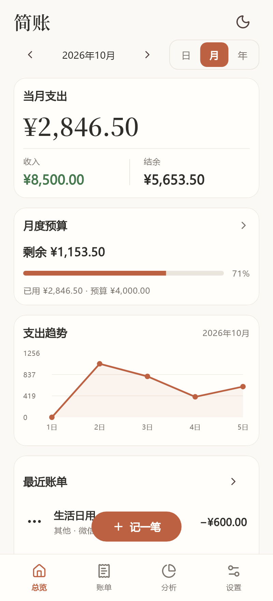
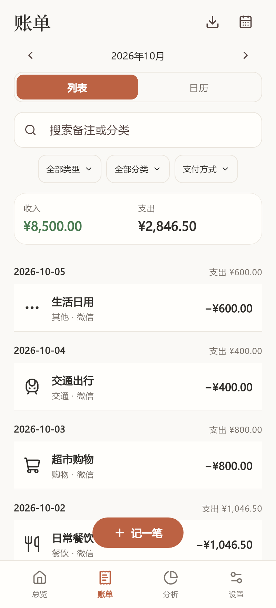
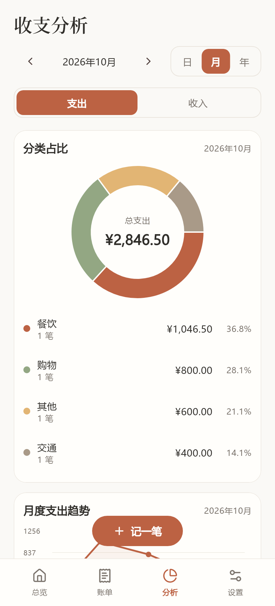
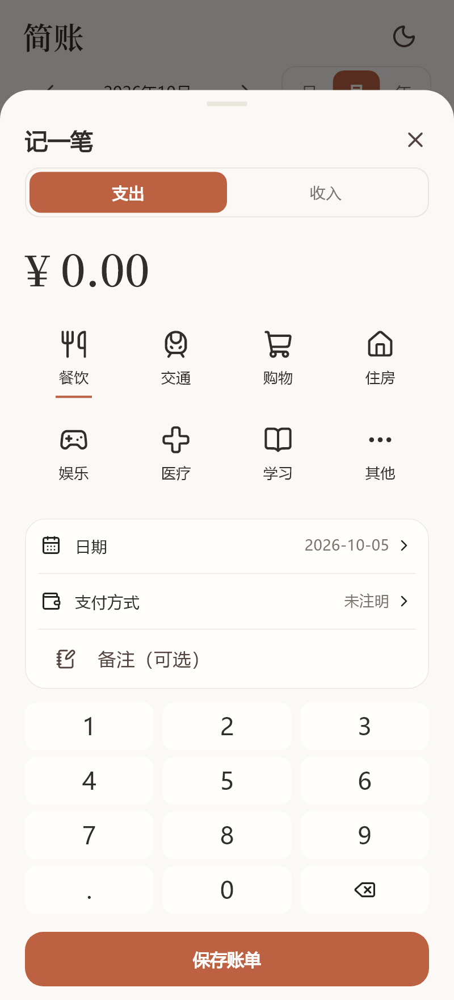
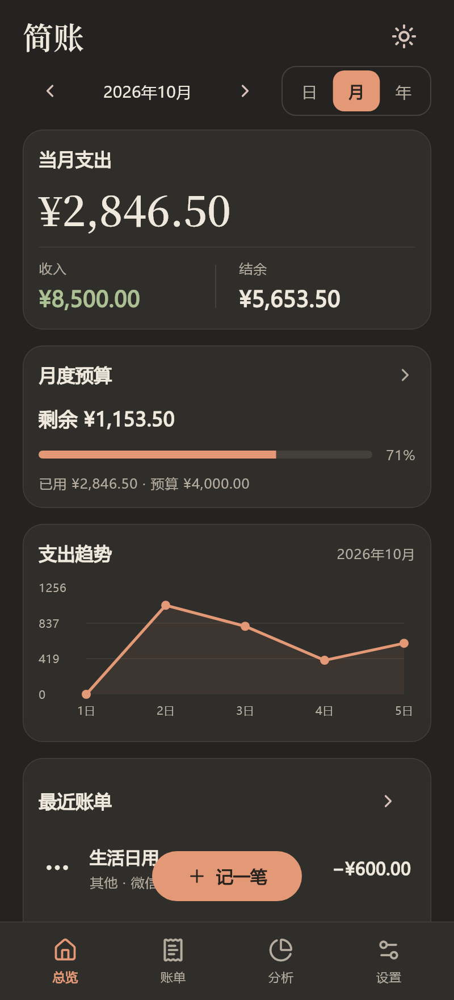
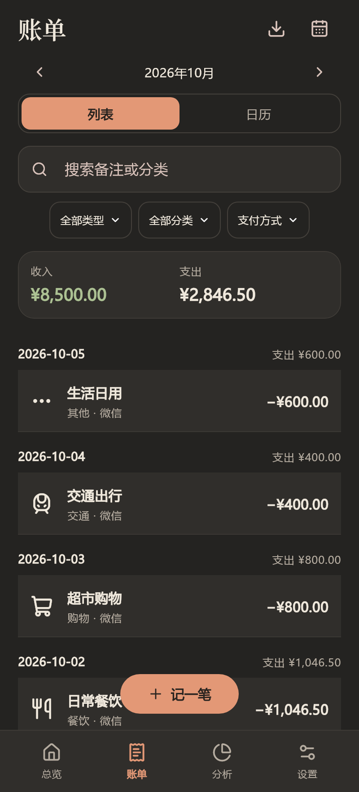
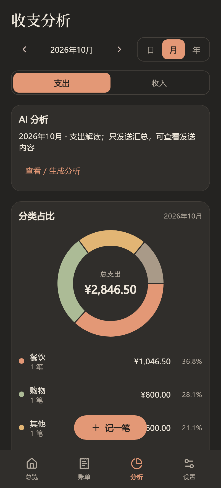
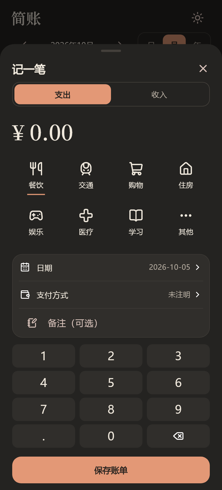
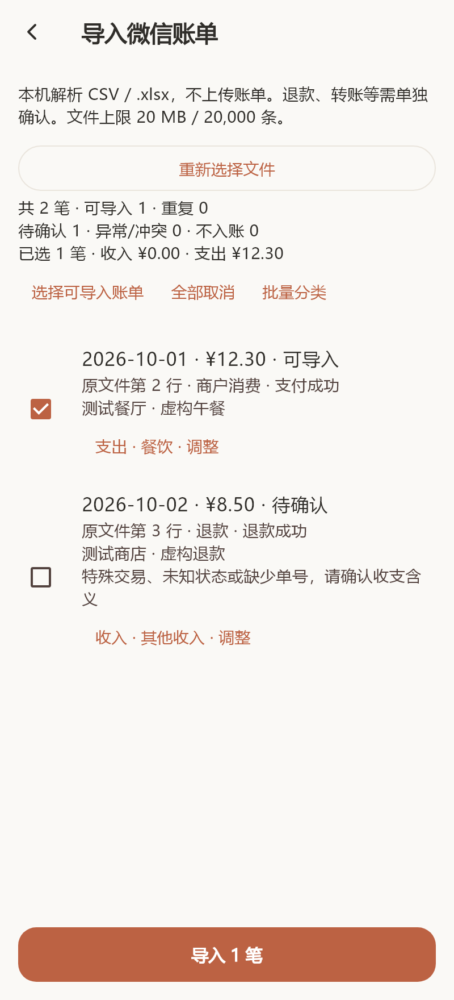
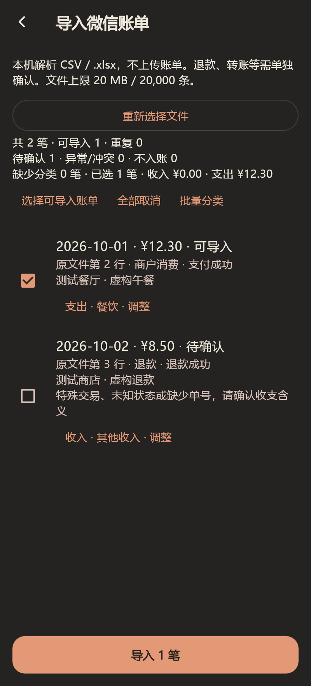

# 简账

简账是一款个人离线收支手账。你可以手动记录收入和支出，查看统计、设置预算，并导出本地备份。应用无需注册，账本保存在手机上。

项目使用 Flutter 和 Dart 开发，目标是支持 iOS 和 Android。当前仅提供 Android 测试版。iOS 工程已接入，最低系统版本为 iOS 15，构建检查见[适配记录](docs/ios-verification.md)。iPhone 真机及签名分发尚未完成。桌面和网页版本不在当前目标内。

[](https://github.com/ace865/jianzhang/actions/workflows/check.yml)


[](LICENSE)

[下载安卓 APK](https://github.com/ace865/jianzhang/releases/download/v1.2.0-beta.2/jianzhang-android-1.2.0-beta.2-build4.apk) · [浏览源码](https://github.com/ace865/jianzhang/tree/v1.2.0-beta.2) · [下载源码 ZIP](https://github.com/ace865/jianzhang/releases/download/v1.2.0-beta.2/jianzhang-1.2.0-beta.2-source.zip) · [发布说明](https://github.com/ace865/jianzhang/releases/tag/v1.2.0-beta.2)

## 安装与试用

Android 正式版 `1.3.0+8` 正在准备，包含服务商模型目录和最新稳定性修复。用户报告已完成 `1.3.0-beta.2+7` 核心流程测试，详情和待补记录见[正式版验证记录](docs/verification-1.3.0.md)。正式包尚未公开上传，以下下载链接仍指向已发布的 `1.2.0-beta.2+4`；新包发布并核对下载后再更新链接。

当前测试版为 `1.2.0-beta.2+4`，包含微信账单导入和可选 AI 分析。支持 Android 7.0 及以上，包含 ARM64、ARMv7 和 x86_64 三种架构。旧版本和附件保留在历史发布页。

1. 已安装旧版时，先在设置中导出完整 JSON 备份，并复制到应用之外。不要卸载旧应用或清除应用数据。
2. 在[发布页](https://github.com/ace865/jianzhang/releases/tag/v1.2.0-beta.2)下载 APK，按系统提示覆盖安装。覆盖升级要求应用包名和签名一致，新版本构建号更高。实际升级效果仍待真机验证。
3. 在“设置 → 导入微信账单”中选择 CSV 或 XLSX 文件。检查分类、重复账单和需确认的交易，再确认导入。
4. 如需 AI，在“设置 → AI 服务”中填写服务商提供的完整 HTTPS 聊天接口地址、模型名称和自己的 API 密钥。在“分析 → AI 分析”中预览发送内容，再确认发送。服务商可能对连接测试和分析请求收费。

首次安装为空账本。建议先验证备份和恢复，再开始记录长期账目。

## 功能与范围

微信 CSV／XLSX 只在本机解析，支持预览、分类和重复识别，详见[导入说明](docs/wechat-import.md)。AI 是可选功能，不配置接口仍可离线记账，详见 [AI 使用说明](docs/ai-analysis.md)。

| 功能 | 实现内容 |
| --- | --- |
| 收支记录 | 新增、编辑和删除账单，填写金额、分类、日期、支付方式和备注 |
| 统计分析 | 按日、月和年统计收支，查看分类占比和趋势，点击图表查看明细 |
| 账单检索 | 按日期、收支类型、分类和支付方式筛选，搜索备注或分类名称 |
| 月度预算 | 设置总预算和分类预算，显示使用进度，复制上月尚未设置的预算项 |
| 日历手账 | 按日查看账单，手动保存每日小记 |
| 备份与导出 | 导出和恢复完整 JSON 备份，导出 CSV 账单表格 |
| 界面设置 | 切换暖白陶土和深色暖灰主题，保存主题选择，开启“减少动画” |
| 微信导入 | 在本机解析 CSV 和 XLSX 文件，识别重复账单并调整分类；退款和转账等交易需你确认 |
| AI 分析 | 使用自选的 OpenAI 兼容接口生成汇总报告和预算建议，支持追问、逐步显示回复和加密历史记录 |

支出达到预算的 80% 或 100% 时，页面会显示提示。当前没有系统通知功能。

### 可选 AI 分析

分析页支持生成汇总报告和继续追问。使用前，在设置页填写聊天接口地址、模型名称和自己的 API 密钥。默认逐步显示回复，也可选择等待完整回复。报告和聊天记录独立加密保存在本机，可以查看和删除。

只有你主动确认发送时，AI 功能才会联网。分析请求包含统计汇总、分类名称和必要的聊天上下文。自动汇总不包含单笔账单、备注、小记或原始支付文件；你输入的聊天内容会随请求发送。请勿在聊天中填写敏感信息。

AI 不修改账本。AI 记录和密钥不包含在账本备份中。服务商可能收费并保留发送的数据。详见 [AI 使用与隐私说明](docs/ai-analysis.md)。

真实 AI 服务的兼容性和手机上的系统安全存储仍待验证。

收支由你手动录入或主动导入微信文件，应用不会自动读取支付账户，也没有云同步功能。“结余”表示所选期间收入减支出；支付方式用于标记账单，应用不管理银行或支付账户余额。

## 界面预览

以下图片使用样例账本，由应用界面测试生成，来源见 [test/app_test.dart](test/app_test.dart)。样例账单不会进入正式安装包。

| 总览 · 浅色 | 账单 · 浅色 | 分析 · 浅色 | 记账 · 浅色 |
| :---: | :---: | :---: | :---: |
|  |  |  |  |

| 总览 · 深色 | 账单 · 深色 | 分析 · 深色 | 记账 · 深色 |
| :---: | :---: | :---: | :---: |
|  |  |  |  |

### 新功能预览

以下图片使用虚构账本和模拟 AI 回复，由应用界面测试生成，来源见 [test/ai_ui_test.dart](test/ai_ui_test.dart) 和 [test/app_test.dart](test/app_test.dart)。

| 微信导入 · 浅色 | 微信导入 · 深色 | AI 分析 · 浅色 | AI 分析 · 深色 |
| :---: | :---: | :---: | :---: |
|  |  |  |  |

## 数据保存与备份

账单保存在本机 SQLite 数据库中。完整 JSON（JavaScript Object Notation，数据交换格式）备份包含账单、分类、预算、每日小记和设置。CSV（Comma-Separated Values，逗号分隔值）导出用于表格查看，不支持完整恢复。

**恢复备份会替换当前账本，不会合并数据。** 应用先校验备份内容，再确认替换。写入失败时，数据库事务会回滚，保留原账本。当前支持恢复的备份文件上限为 50 MB。

请定期将完整备份复制到另一台设备。卸载应用或清除应用数据会删除本机账本。数据库和导出文件没有应用级加密，分享文件前请确认其中没有个人消费记录。

升级步骤和覆盖安装条件见[安装与试用](#安装与试用)。

## 验证状态

`1.2.0-beta.2+4` 的验证范围：

- Flutter 静态检查、78 项自动化测试、Android 调试和原签名发行构建；实际结果见[本版验证记录](docs/verification-1.2.0-beta.2.md)。
- 自动检查增加 UTC、上海和纽约时区的 Excel 日历回归。
- 金额处理、日期边界、账单筛选、备份往返、损坏备份保护和事务回滚已有测试覆盖。
- 界面测试覆盖记账、编辑、删除、主题切换，以及部分小屏和字体放大场景。

GitHub Actions 会检查代码格式、运行静态检查和测试，并构建 Android 调试包。结果见[自动检查记录](https://github.com/ace865/jianzhang/actions/workflows/check.yml)。

手机安装、系统文件选择器、手机安全存储、真实 AI 服务，以及同签名覆盖升级仍待真机验收。帧率、功耗和冷启动时间尚无测量结果。完整范围见[版本验证记录](docs/verification-1.2.0-beta.2.md)。

## 源码与开发

### 技术结构

界面和主要业务逻辑使用 Dart 编写。Android 工程负责平台集成和安装包构建，本地数据由 SQLite 保存。

| 路径 | 职责 |
| --- | --- |
| `lib/main.dart` | 应用启动、主题加载和页面导航 |
| `lib/core/models.dart` | 账单、分类、预算、日期范围和金额规则 |
| `lib/core/controller.dart` | 数据修改、页面刷新、备份和导出 |
| `lib/core/database.dart` | 数据表、校验、查询、统计和事务 |
| `lib/ui/` | 总览、账单、分析、设置、记账编辑器和图表 |
| `test/` | 数据库与界面测试 |
| `android/` | Android 工程与签名配置 |
| `ios/` | iOS 工程、插件集成和 Keychain 权限配置 |
| `scripts/` | Windows 发行包构建和源码打包脚本 |

金额使用整数分存储。修改数据库结构时，需要提供保留旧数据的迁移逻辑和回归测试。

### 本地检查

项目记录的开发环境为 Flutter 3.47.6、Dart 3.13.5、JDK 21 和 Android SDK Platform 36。环境配置见[构建指南](docs/BUILD.md)。

```sh
git clone https://github.com/ace865/jianzhang.git
cd jianzhang
flutter pub get --enforce-lockfile
dart format --output=none --set-exit-if-changed lib test
flutter analyze --no-pub
flutter test --no-pub
flutter build apk --debug --no-pub
```

调试安装包输出到 `build/app/outputs/flutter-apk/app-debug.apk`。工具链安装、Windows 发行包构建和签名说明见[构建指南](docs/BUILD.md)。

官方升级包由维护者使用原签名构建。协作者使用自己的测试签名，测试包无法覆盖官方签名版本。当前工程在未配置发行签名时，会使用调试签名构建 release 包；发布前必须确认签名配置。

新版源码 ZIP 完整来自 `v1.2.0-beta.2` 标签，包含 Flutter/Android 工程、锁文件、测试、构建脚本和文档，与本版 APK 对应。首版历史附件的补充文档规则仍保留，见[源码版本说明](docs/SOURCE_VERSION.md)。主分支会继续更新。

## 反馈与共创

在 [Issues](https://github.com/ace865/jianzhang/issues) 提交问题时，请附手机型号、安卓版本、应用版本、复现步骤和预期结果。截图中请遮挡个人账目。

开发与版本规则集中维护在[统一规范](docs/development.md)。Codex 从 [AGENTS.md](AGENTS.md) 读取入口，Claude 从 [CLAUDE.md](CLAUDE.md) 读取入口。

作者 `ace865` 与协作者 `songyu00yo` 共同开发，`songyu00yo` 更侧重 iOS。代码修改从 `main` 创建分支，再提交 Pull Request（合并请求），由另一方在 GitHub 批准最新提交后合并。纯文档可以直接提交。紧急直提或免审须双方事先同意，发布需另行确认。流程见[贡献指南](CONTRIBUTING.md)，具体分工见[双方协作约定](docs/development.md#双方协作约定)。

版本采用 `主版本.次版本.修订版本`：大更新升主版本，新增功能升次版本，普通优化和修复升修订版本。升级某一位后，右侧数字归零。构建号独立递增。测试版使用 `alpha`（早期验证）、`beta`（功能测试）和 `rc`（候选发布）后缀。阶段条件、跨平台发布和编号示例见统一规范。纯文档修改不更新应用版本。

仓库公开，请勿提交真实账本、备份、签名密钥、密码、令牌或机器专用配置。

## 开源许可

项目自有代码采用 [MIT License](LICENSE)，版权归 `ace865 and contributors` 所有。第三方依赖和字体保留各自许可，详见[第三方说明](THIRD_PARTY_NOTICES.md)。
