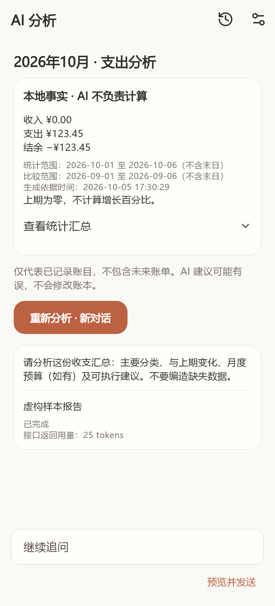
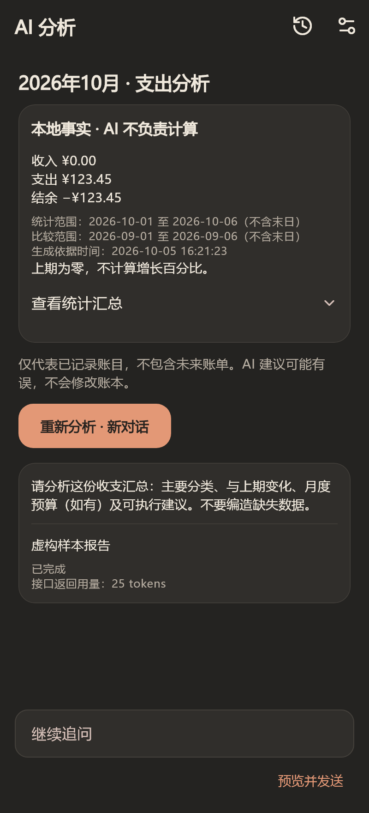

# AI 分析与聊天

AI 分析已包含于 Android `1.2.0-beta.2` 测试版。iOS 工程已接入，但真机和分发尚未验证。服务商预设与手动模型刷新在 `1.3.0-beta.1` PR 中实现，尚未合并或公开发布，见[模型目录说明](ai-model-catalog.md)。

## 配置与入口

设置 → AI 服务：选择预设或填写完整 HTTPS Chat Completions 端点、模型名称及自己的 API 密钥。支持 Bearer 验证的文本聊天，不支持原生 Claude、图片、工具调用、云会话或自动读取模型列表；新目录只在主动点击并确认后查询。

默认逐步显示回复。接口不支持 SSE 时关闭「逐步显示回复」并重新保存。输出上限 1536 tokens，可手动选择 `max_tokens` / `max_completion_tokens`。不兼容时不会偷偷切换服务或自动重复计费请求。测试已保存配置前会提示费用；测试消息不包含账本。

分析 → AI 分析：跟随日/月/年及收入/支出选择，查看本地事实后生成报告。未配置时引导设置，返回原分析页面。每次发送均可展开「查看实际发送内容」，首次发送与地址变化需重新确认目标服务。只有主动发送或测试才联网，原有离线记账不依赖 AI。

以下为虚构账本与模拟回复的应用渲染预览，不是实际模型效果或真机截图：

| 暖白陶土 | 深色暖灰 |
| --- | --- |
|  |  |

## 统计依据与局限

本地在一次 SQLite 读事务中计算整数分总额、分类金额与占比、趋势、上期汇总和月度预算。当前期间截至今天（包含今天、不含未来账单），历史期间完整统计。未结束期间与上期相同天数比较，超出上期天数则截到上期末；闰年比较采用天数而非假设相同月日。界面显示实际起止范围，末日不包含。上期为零不计算增长百分比。

只有已记录数据才能分析。未记录不等于无消费；空账本和未来期间不会调用 API。关键金额由本地事实卡片显示，AI 文字可能出错，不承诺财务建议正确，也不会写入账本。

## 发送范围与密钥

发送统计汇总、用户分类名称、分析问题及本段对话必要上下文。不发送单笔账单、商户、订单号、支付方式、备注、每日小记、原始微信文件或数据库。自定义分类和聊天文字也可能包含隐私，请发送前自行检查。

API 密钥仅供身份验证，绑定完整端点并使用系统安全存储；更换地址需重新填写，不向新地址转发原密钥。正式通信仅 HTTPS，证书验证不可关闭，重定向不跟随。没有应用服务器、内置共享密钥或自动重试。设备被破解时系统安全存储不能保证绝对安全，推荐使用可撤销、额度受限的个人密钥。

## 历史、追问与删除

每次报告独立保存统计快照、生成依据时间、端点/模型和聊天。相同快照/端点/模型/提示词版本的已完成报告优先复用，不自动联网。重新分析创建新对话。账本或预算更新时核对摘要，旧对话保留原依据并提示过期；即使重启或恢复账本也重新核对。更换服务或模型后旧对话仅供查看，不自动转发。

追问携带快照、原报告、最近六轮完整问答和当前问题，不携带其他对话；较早聊天仍本地保存，但不再作为上下文。单次输入最多 2000 字，请求体最多 96 KiB，超限提示新建对话或缩小范围，不静默裁剪。失败、停止和达到输出上限的未完成回复不进入后续上下文。

本地快照、报告和聊天以 AES-256-GCM 加密，每次保存使用新 nonce，加密密钥保存在系统安全存储。独立 AI 目录不改变账本数据库/备份格式，不包含在账本导出中。删除对话同时删除关联快照；清空记录清理本地加密文件与加密密钥，保留 API 配置；删除 API 密钥单独操作。损坏或丢失加密密钥时不覆盖记录，不降级到明文，可明确清空后重新开始。

退出分析页会停止本次生成；重启后的中断请求不会自动重发。停止或超时不保证服务商撤销处理或费用。应用发送 `store:false`，但不能据此承诺第三方服务不保留数据；删除本机记录不删除服务商副本，保留政策需向服务商确认。卸载、清除应用数据或更换设备后，AI 历史无法从账本备份恢复。

## 限制与验证

只以虚构数据及模拟 HTTP/SSE 验证协议，不代表所有兼容接口可用。真实网络、真实模型、手机安全存储、安装/覆盖升级及性能需真机验证，不做模拟器测试。验证状态见 [整合版验证记录](verification-1.2.0-beta.2.md)。

`1.2.0-beta.2+4` 已整合微信导入，数据库/备份为 v2，并保留 v1 升级和旧备份恢复。原签名、更高构建号支持从 1.0、1.1 微信导入开发版和 1.2 AI 独立开发版覆盖升级；真实手机升级仍待验收，先备份、不卸载。历史 `1.2.0-beta.1+3` 的 DB1 限制只适用于旧独立包，不适用于新版。AI 存储名称、密钥绑定和加密格式保持不变。

协议参考：[OpenAI 创建聊天回复](https://developers.openai.com/api/reference/resources/chat/subresources/completions/methods/create)、[流式事件](https://developers.openai.com/api/reference/resources/chat/subresources/completions/streaming-events)。
