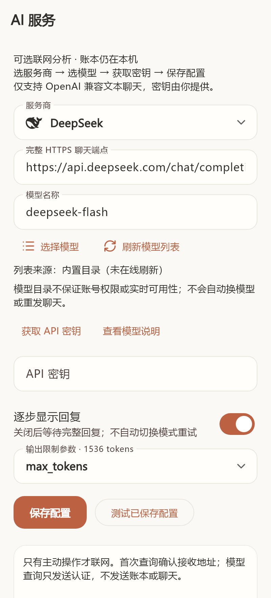
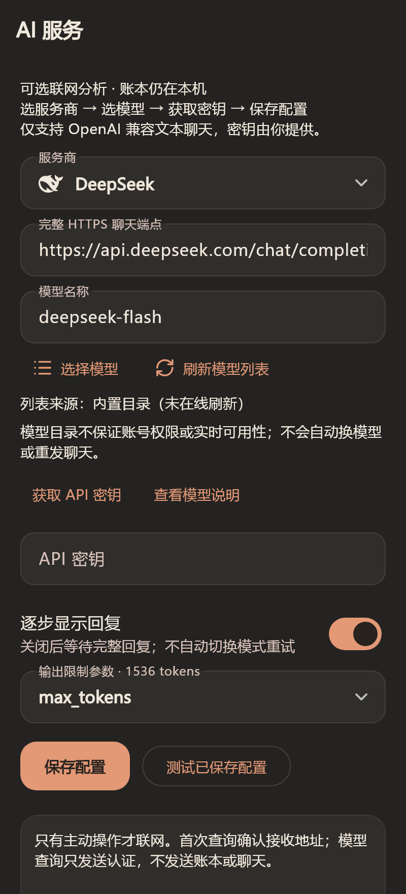

# AI 服务商预设与手动模型刷新

入口：「设置 → AI 服务」。选择服务商会填入完整聊天端点、推荐模型和输出限制参数，仍可手动修改。选模型、保存、打开设置不联网；只有点击刷新或连接测试并确认才请求服务。测试连接可能计费，与模型查询独立。旧地址与模型原样恢复，不自动迁移。

## 内置目录

2026-10-09 按官方资料核对。名称不是模型 ID，托管模型也不等同于原厂模型。实际账号权限、费用与兼容性以服务商为准。

| 服务商 | 默认模型 / 其他模型 | 输出参数 | 官方说明 |
| --- | --- | --- | --- |
| DeepSeek | `deepseek-flash` / `deepseek-v4-pro` | `max_tokens` | [调用说明](https://api-docs.deepseek.com/quick_start/pricing-details-cny/) |
| 千问（百炼，北京） | `qwen3.8-flash` / `qwen3.7-plus` | `max_tokens` | [模型目录](https://help.aliyun.com/zh/model-studio/models) |
| Kimi | `kimi-k2.6` / `kimi-k3` | `max_completion_tokens` | [聊天接口](https://platform.kimi.com/docs/api/chat) |
| 智谱 | `glm-4.7-flash` / `glm-4-flash-250414` | `max_tokens` | [模型概览](https://docs.bigmodel.cn/cn/guide/start/model-overview) |
| 硅基流动 | `deepseek-ai/DeepSeek-V4-Flash` / `moonshotai/Kimi-K2.7-Code` | `max_tokens` | [托管接口](https://docs.siliconflow.cn/docs/api/chat-completions-post) |
| OpenAI | `gpt-4.1-mini` / `gpt-4.1` | `max_completion_tokens` | [官方模型](https://developers.openai.com/api/docs/models) |
| Gemini | `gemini-3.8-flash` | `max_tokens` | [兼容层](https://ai.google.dev/gemini-api/docs/openai) |

输出上限仍为 1536 tokens。未知模型不推测输出参数；聊天失败不自动修改参数、换模型或重发付费请求。

## 查询行为

- DeepSeek `/models`；OpenAI、Kimi、硅基流动各自官方 `/v1/models`；Gemini `/v1beta/openai/models`。目录声明完整 URI，不拼接跨域地址。
- 千问使用独立 `/api/v1/models` 分页适配器，核对 `output.total` 和页码，按 `capabilities=TG` 查询。北京地域需要业务空间专属域名，先将完整聊天端点填写为 `https://你的空间ID.cn-beijing.maas.aliyuncs.com/compatible-mode/v1/chat/completions`，重新提供该地址密钥并保存；缺少空间信息时明确引导，不猜测空间或跨地域发送密钥。[查询说明](https://help.aliyun.com/zh/model-studio/list-models)
- 智谱首版不支持在线目录，保留内置列表及官方说明。自定义服务另填同源 HTTPS 模型列表地址，支持 `data[].id`；没有地址时不猜测，未知分页协议不接受部分列表。
- 仅使用已保存配置和绑定密钥；未保存修改要求先保存。首次查询地址需确认，只发送认证，不发送账本、汇总或聊天，不触发聊天测试。
- 成功列表去重、推荐优先、可搜索。明确非文本能力模型过滤；未知能力标「兼容性未验证」。不自动保存其他模型；当前模型缺失仅提示核对权限，不认定停用。
- 连接 15 秒、接收 30 秒、总时限 60 秒；最多 20 页、2 MB、2,000 条。失败、空列表或分页不完整保留原成功列表和时间；可取消、禁止重复点击，表单切换后丢弃旧响应。不自动重试、不重定向、不绕过证书。

## 本地安全、依赖与平台

缓存单独使用 AES-GCM，独立随机 nonce 与系统安全存储的加密密钥；按完整聊天端点隔离。更换/删除 API 密钥、改变查询地址或清空 AI 记录时清理缓存。账本数据库、备份和现有聊天格式不变。官方链接在系统浏览器打开，不携带密钥或账本；失败可复制。

本地 Lobe Icons 单色 SVG 以主题前景色渲染，不下载远端图片。资源固定于 `c385b2b8d1f9e19aa86e628d4e23c91ee1111a47`，MIT 许可保留在资源目录、第三方清单与应用内许可。

`url_launcher` 支持 Android API 24+、iOS 13+，工程保持 Android 24 / iOS 15；`flutter_svg` 为共享 Flutter 渲染。为兼容 SVG 编译器约束，将 XML 从 7.1.0 调整为 7.0.1，重新验证全部微信导入回归，不修改解析规则。iOS 新插件锁文件由 macOS CocoaPods 1.17.0 生成，最终仍严格使用 `pod install --deployment`。

## 样例渲染

虚构配置的应用渲染，不是真机截图，不含真实密钥或账本。

| 暖白 | 深色 |
| --- | --- |
|  |  |

见 [验证记录](verification-1.3.0-beta.1.md)。首版仅模拟接口验证；真实服务、手机浏览器、安全存储、覆盖升级与性能未验证，不宣称七家均已兼容。
