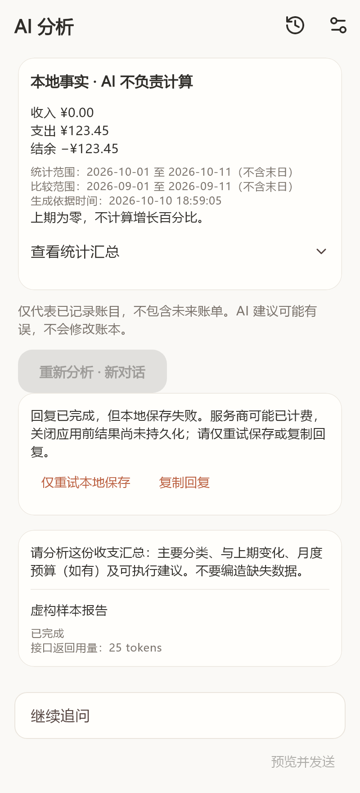

# 稳定性修复记录

负责人：ace865 / Codex。基于主分支 `697c53e`，修复 Issue #13–#21。
涉及共享 Flutter、Android / iOS 构建检查及 Windows 脚本。

目标：配置恢复与密钥异常保护、CSV 换行兼容、退款状态核对、AI 本地保存重试、
分类匿名区分、日历日期筛选、账单页文案和构建指南。

保留数据库及账本备份 v2、既有 AI 历史，兼容旧导入来源摘要。
不自动修改原账、不重发付费请求，不改变分支保护或协作规则。

当前版本保持 `1.3.0-beta.1+6`，不分配新的分发构建号，不创建标签、APK 附件或 Release。
验收使用虚构账本和模拟服务，不使用真实密钥或私人文件，不运行模拟器。
完成后通过 PR 请 songyu00yo 审阅最新提交，未经批准不合并。

## 实施内容

| Issue | 修复与回归 |
| --- | --- |
| #13 | 独立加载保存的配置；捕获密钥读取错误并隔离已切换地址、已关闭页面的异步错误；分别覆盖历史损坏与密钥丢失 |
| #14 | iOS 构建与运行从 pubspec 提取数字版本、构建号，不再固定旧值 |
| #15 | 两个脚本提前检查 PowerShell 7.2+，发行签名限 Windows；UTF-8 BOM 保证 5.1 能读取中文错误；独立临时仓库验证打包 |
| #16 | 新来源摘要携带状态散列，变化进入冲突；旧普通订单仍去重，旧特殊状态未知时保守核对；备份后仍能判重 |
| #17 | 只统一 CSV 记录行尾，保留引号内 CRLF、逗号与转义引号；覆盖 LF、CRLF、CR 和混合输入 |
| #18 | 独立保存错误状态、保留内存完整回复、仅重试保存／复制；未保存时禁用当前对话追问和重新分析；验证重试无新增请求和重启读取 |
| #19 | 按日历年月日计算末日、判断单日；覆盖夏令时开始／结束、跨月／年和重新打开选择器 |
| #20 | 日汇总跟随收支筛选，全部模式显示收入与支出；空态提示返回总览，不新增记账入口 |
| #21 | 快照 schema 2 使用分类 ID 的命名空间散列，预算标识一致，区分总预算；不发送原始 ID、不合并同名分类 |

来源摘要用原有文本字段表示 `v2:旧内容散列:状态散列`，不增加表或备份字段。
较早应用不支持新摘要，会拒绝含新摘要的备份；请使用修复版或后续版本恢复，不要降级。
既有 AI 历史不改写，旧快照可能仍包含同名分类歧义；用户主动生成新报告时使用新格式。
Issue #22 是协作规则确认，不在本次代码修复内，不调整保护设置、不绕过审阅。

## 本地验证（2026-10-10）

Windows，Flutter 3.47.6 / Dart 3.13.5，版本仍为 1.3.0-beta.1+6。

- 锁文件安装、35 个 Dart 文件格式检查、静态分析通过，依赖及锁文件未修改。
- 138 项测试通过（原 121 项，新增加 17 项）；使用虚构账本和模拟服务。
- Android debug 构建通过；SDK XML 工具版本有非阻断警告，不作为分发安装包。
- PowerShell 5.1 实测两脚本在任何签名／产物写入前提示需要新版。
- PowerShell 7 下独立临时仓库的源码 ZIP 与提交逐文件摘要校验通过，重复打包拒绝覆盖；没有创建主仓库标签。
- 日期选择器回归已加入 UTC、上海、纽约 CI；Android、iOS 无签名构建及 Windows 脚本 CI 结果待 GitHub 运行。

未进行模拟器或真机安装、覆盖升级、实际文件选择、安全存储、真实服务计费和性能测量。
本次未构建／分发新的正式签名 APK，iOS 签名及分发未验证。

## 界面预览

虚构账本与模拟 AI 完整回复后保存失败的 Flutter 应用渲染，不是真机或真实服务截图。

